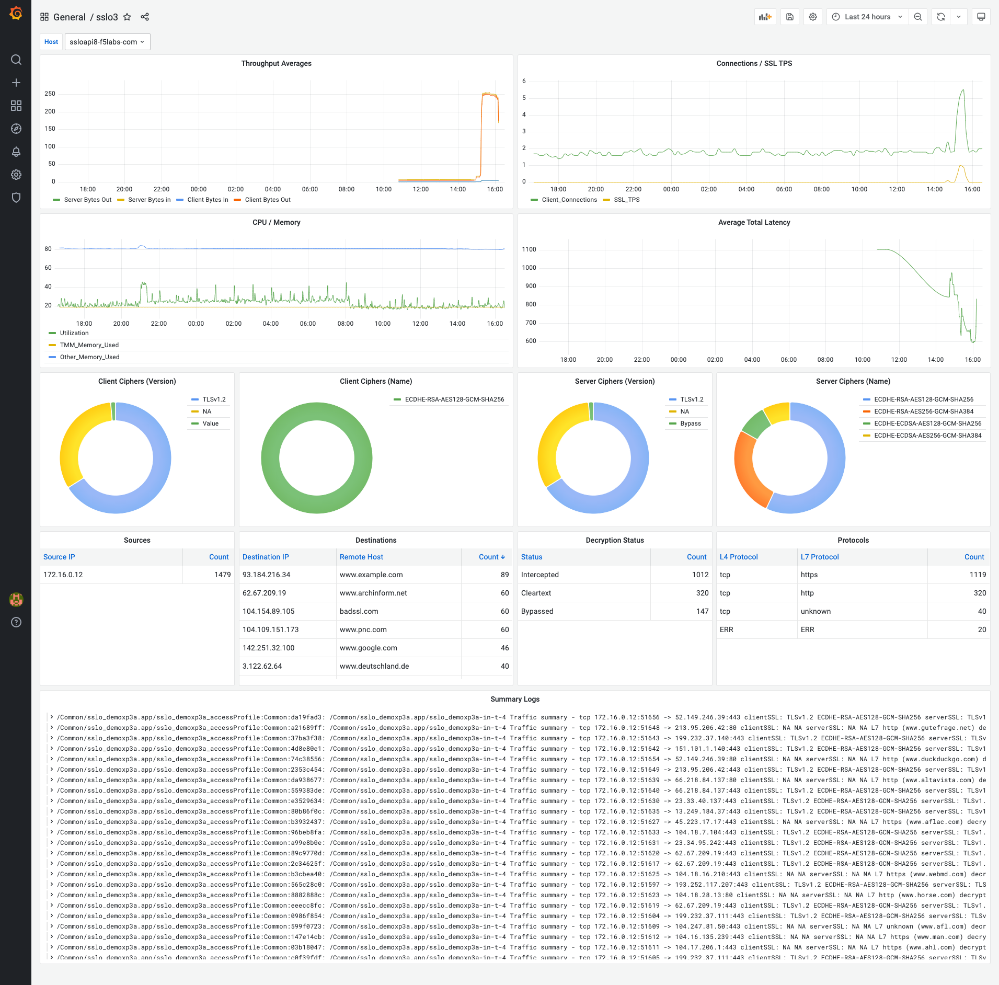

# SSL Orchestrator Telemetry Project
## Tools: Loki :: Graphite :: Grafana

Please refer to official Loki documentation at: https://grafana.com/oss/loki/. Loki is a "*horizontally-scalable, highly-available. multi-tenant log aggregation system inspered by Prometheus*". In this case, as the important data coming from SSL Orchestrator is made available in log messages, Loki is a perfect tool for aggregating that information into usable metrics and searchable context. Loki will rely on a separate utility, Promtail, as its collector.

Please refer to official Graphite documentation at: https://graphiteapp.org/. Where Loki collects log information, some useful **system** data is better to collect from BIG-IP statistics. Coupled with F5 Telemetry Streaming (https://clouddocs.f5.com/products/extensions/f5-telemetry-streaming/latest/), Graphite is used here to collect iControl stats data directly.

Please refer to official Grafana documentation at: https://grafana.com/. Grafana is a free and open source (FOSS) dashboard for a large ecosystem of data providers, collectors and aggregators. In this case, Loki collects log information and converts to metrics, Graphite collects stats, and both source the visibility panels in the Grafana dashboard. 

All together, the following instructions define a minimum configuration for presenting multi-system SSL Orchestrator health and availability.

Example:




### Installation
While not expressly required, the steps to building Loki, Promtail, Graphite, and Grafana in Docker containers is shown below. This is an easy way to get an observability system up and runninq quickly. The entire set of tools can also be created from a single docker-compose file (included here).

1. **Install Loki** (log aggregator)
    ```
    $ wget https://raw.githubusercontent.com/grafana/loki/v2.3.0/cmd/loki/loki-local-config.yaml -O loki-config.yaml
    docker run -d --name loki --restart unless-stopped -v $(pwd):/mnt/config -p 3100:3100 grafana/loki:2.3.0 -config.file=/mnt/config/loki-config.yaml
    ```

2. **Install and configure Promtail** (log collector)
&nbsp;
Copy the promtail-config.yaml file (in this repository folder) to the local directory. Edit the file to point the client's url (line 9) to the local IP so that Promtail can access Loki. Promtail will establish a remote Syslog service on TCP port 1514.
    ```
    docker run -d --name promtail --restart unless-stopped -p 1514:1514 -v $(pwd):/mnt/config -v /var/log:/var/log grafana/promtail:2.3.0 -config.file=/mnt/config/promtail-config.yaml
    ```

3. **Install Graphite** (stats collector)
    ```
    docker run -d --name graphite --restart unless-stopped -p 88:80 -p 2003-2004:2003-2004 -p 2023-2024:2023-2024 -p 8125:8125/udp -p 8126:8126 graphiteapp/graphite-statsd
    ```

4. **Install and configure Grafana** (dashboard)
    ```
    docker run -d --name grafana --restart unless-stopped -p 3000:3000 grafana/grafana
    ```

    To install all of these services in a single command, ensure that Docker-Compose is running on the observability server, copy the **docker-compose.yaml** file to that server, and then execute:

    ```
    docker-compose up -d
    ```

    Once all observability services are up, you can access the Grafana dashboard at **http://server-ip:3000**. Log into that server, navigate to Dashboards, and then Manage. Click the Import button, and then copy the contents of the included **config-grafana.json** file into the window. Click Import again to complete the process.


5. **Install and configure F5 Telemetry Streaming** (stats publisher)
Use the included **f5-ts-install.sh** Bash script to remotely install the latest F5 Telemetry Streaming package. This will download the latest RPM from the Github repository, upload that to the BIG-IP, and then initiate package installation. Edit the script and update the "CREDS" field with the correct BIG-IP user:pass information. Then run the script, providing the IP of the BIG-IP as an argument. Example:
    ```
    chmod +x f5-ts-install.sh
    ./f5-ts-install.sh 172.16.1.83
    ```

    Now edit the included **config-f5-ts.json** file and change the StatsdConsumer host entry to point to the IP of the server running Graphite/Statsd. Use the included **f5-ts-config.sh** Bash script to push this configuration to the BIG-IP. Edit the Bash script to update the "CREDS" field with the correct BIG-IP user:pass information. Then run the script, providing the IP of the BIG-IP, and the path to the config file as arguments. Example:
    ```
    chmod +x f5-ts-config.sh
    ./f5-ts-config.sh 172.16.1.83 config-f5-ts.json
    ```


6. **Install and configure an F5 log publisher** (log publisher)
Loki aggregates logs collected from the Promtail syslog service. To get those logs to Promtail, the BIG-IP must be configured with a log publisher that attaches to the SSL Orchestrator security policy. The first command below creates the pool. Adjust this to send the IP address of the server running Promtail. The secod command creates a remote high speed log destination that points to this pool. The third command creates an RFC5424 log formatter. The fourth command creates the log publisher; and the fifth command creates a separate log filter to catch and send specific SSL error messages.
    ```
    tmsh create ltm pool loki-syslog-pool monitor gateway_icmp members replace-all-with { 172.16.1.89:1514 }
    tmsh create sys log-config destination remote-high-speed-log loki-syslog-hsl-dest protocol tcp pool-name loki-syslog-pool
    tmsh create sys log-config destination remote-syslog loki-syslog-dest format rfc5424 remote-high-speed-log loki-syslog-hsl-dest
    tmsh create sys log-config publisher loki-syslog-pub destinations replace-all-with { loki-syslog-dest }
    tmsh create sys log-config filter filter-01260009 message-id 01260009 publisher loki-syslog-pub
    ```

    Alternately you can use the included **f5-logpub-install.sh** Bash script to perform all of the above actions. Edit the Bash script to update the "CREDS" field with the correct BIG-IP user:pass information, and edit the "SYSLOG" field to point to the IP and port of the server running the Promtail service. Then run the script, providing the IP of the BIG-IP as an argument. Example:
    ```
    chmod +x f5-logpub-install.sh
    ./f5-logpub-install.sh 172.16.1.83
    ```

    The log publisher must now be attached to an existing SSL Orchestrator security policy. Edit the below to point to the correct named object.
    ```
    tmsh modify apm log-setting <profile> access replace-all-with { general-log { log-level { access-control err access-per-request err ssl-orchestrator info } publisher loki-syslog-pub type ssl-orchestrator } }

    example:
    tmsh modify apm log-setting sslo_demoxp3b.app/sslo_demoxp3b-log-setting access replace-all-with { general-log { log-level { access-control err access-per-request err ssl-orchestrator info } publisher loki-syslog-pub type ssl-orchestrator } }
    ```